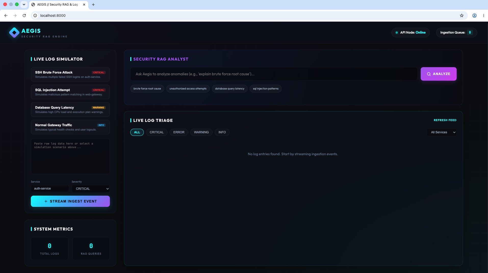
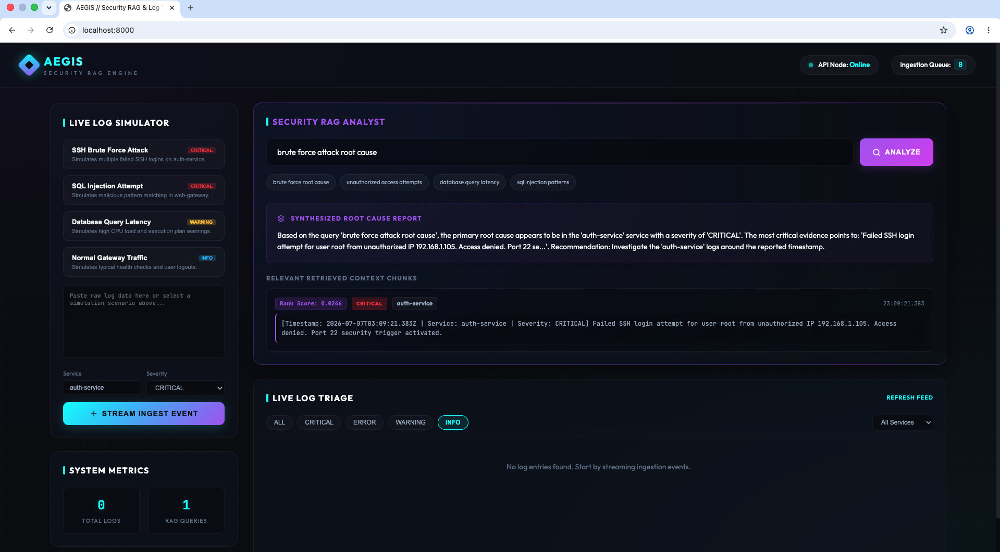
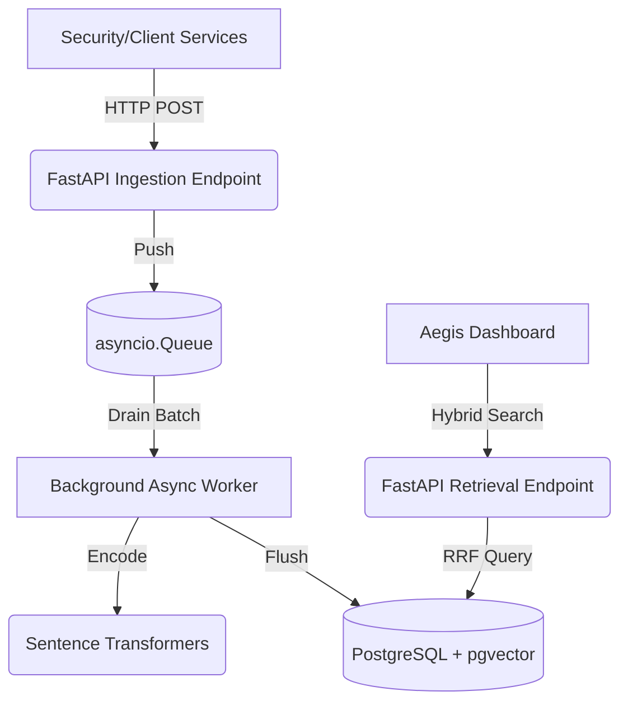

# 🛡️ Aegis: High-Throughput Async Security RAG & Log Triage Platform

Aegis is an enterprise-grade, high-throughput asynchronous log triage and Retrieval-Augmented Generation (RAG) platform. It is engineered to process, embed, and search massive volumes of security logs in real-time, leveraging FastAPI, PostgreSQL `pgvector`, and `sentence-transformers`.


<br>


## 🚀 Technical Highlights

This project was built to solve the challenges of ingesting and querying unstructured security logs at scale:

- **Asynchronous Ingestion Pipeline:** Utilizes Python's `asyncio.Queue` and batched database inserts via SQLAlchemy & `asyncpg` to achieve non-blocking, high-throughput log ingestion without dropping events.
- **In-Memory Tensor Batching:** Embeddings are generated on the fly using `all-MiniLM-L6-v2`. Log chunks are buffered and passed to the model in batches to fully utilize CPU/GPU tensor operations.
- **Advanced Hybrid Search (RRF):** Implements a highly optimized CTE (Common Table Expression) in PostgreSQL to perform hybrid search at the database level. It merges **Full-Text Search (tsvector)** and **Semantic Cosine Distance (pgvector)** using Reciprocal Rank Fusion (RRF).
- **Heuristic Reranking:** Applies real-time time-decay mathematical multipliers and severity-based adjustments to surfaced RAG contexts to ensure the most critical and recent logs are prioritized for analysis.

## 🏗️ Architecture



## 💻 Tech Stack

- **Backend:** Python, FastAPI, Uvicorn, asyncio
- **Database:** PostgreSQL, `asyncpg`, SQLAlchemy, `pgvector`
- **Machine Learning:** HuggingFace `sentence-transformers`, PyTorch
- **Frontend:** Vanilla JS, CSS Glassmorphism styling
- **Infrastructure:** Docker, Docker Compose

## 🛠️ Local Setup

Getting the platform running locally is a single-command process using Docker.

1. **Clone the repository**
   ```bash
   git clone https://github.com/nanaNdrew/High-Throughput-Async-Security-RAG-Log-Triage-Platform.git
   cd High-Throughput-Async-Security-RAG-Log-Triage-Platform
   ```

2. **Start the database and backend**
   ```bash
   docker-compose up -d --build
   ```
   *Note: This spins up the Postgres instance with the `pgvector` extension pre-installed, and builds the FastAPI worker.*

3. **View the Dashboard**
   Open your browser and navigate to `http://localhost:8000/`.

## ☁️ Cloud Deployment

This repository is configured for immediate deployment on cloud platforms like Render or Railway via the provided root `Dockerfile`. 

To deploy:
1. Provision a PostgreSQL database (ensure the `pgvector` extension is enabled).
2. Create a Web Service connected to this repository.
3. Add the `DATABASE_URL` environment variable (e.g., `postgresql+asyncpg://...`).
4. The deployment will automatically install the highly-optimized CPU PyTorch wheel to conserve memory and launch the application.

---
*Engineered for scale, speed, and security intelligence.*
